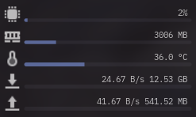

# Widgets for dashboards

with the ongoing trend in awesomewm for using dashboards full of widgets and no widget library
specifically filling that niche i decided heck, why not?

## Licenses

"wtf is going on in here?"
well, i'm taking code from different sources so i gotta also take their licenses and combine them in
a sensible way, for effect the repo as a whole is under the most restrictive license inside it,
while the code of each individual widget is under the license within it's subdirectory, in case any
widget doesn't have a license file inside it's subdirectory then it is covered by the topmost
license file on the root of the repo.
